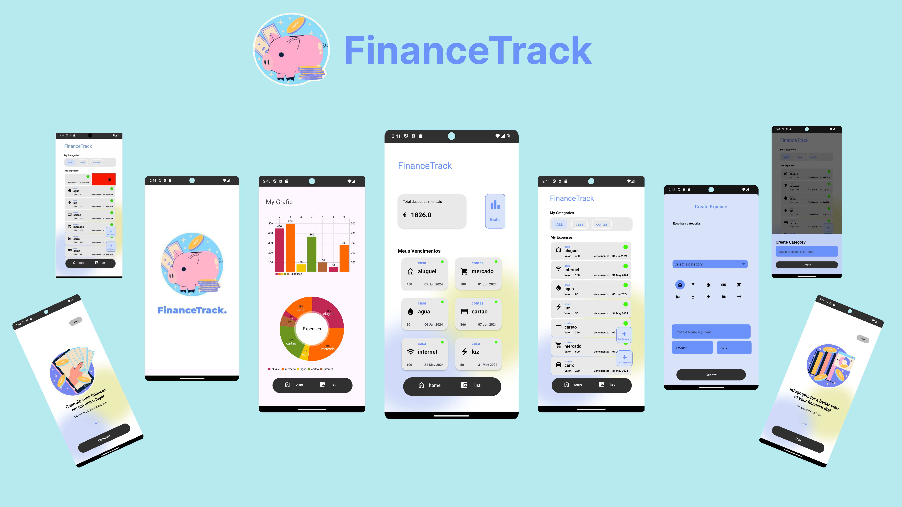

<div align="center">

By Raphael and Bruno
</div>


# FinanceTrack

**Description:**
  FinanceTrack is an intuitive and efficient financial application designed to help you manage your daily expenses with ease and precision. With a user-friendly interface, practical features and support for Portuguese and Spanish, Finance Tracker is the ideal tool for international users who want to keep their finances organised.

**Key Features:**

1. **Expense Recording:**
   - Quickly and easily add your daily expenses. Categorize your expenses for better organization and future analysis.

2. **Intuitive Graphs:**
   - View your expenses in detailed graphs that show where your money is going.

3. **Swipe-to-Delete:**
   - Keep your expense list organized with the swipe-to-delete feature. Simply swipe your finger sideways over an expense to quickly delete it.

4. **Due Date Status:**
   - Stay on top of your bills and expenses with due date status. The app highlights expenses that are upcoming, overdue, with distinct colors for easy identification and to prevent missed payments.

5. **Press Delete Category:**
   - Keep your expense records clean and organised with the delete by category feature. Press on a specific category to delete all the expenses associated with it at once, allowing you to clean up your financial data quickly and efficiently.

6. **Internationalisation:**
   - FinanceTrack is available in Portuguese and Spanish, providing a personalised experience for speakers of these languages. The language is chosen according to the language of the device.

**Benefits:**
- **Total Control:** Keep your finances under control with a clear view of your expenses and due dates.
- **Time Savings:** Quickly delete unnecessary expenses with a simple swipe gesture.
- **Easy Cleaning:** Quickly delete all expenses from a specific category with a single press.
- **Delay Prevention:** Manage your payments with due date status, avoiding late fees and interest charges.

FinanceTrack is more than just an expense manager; it's your financial partner, helping you achieve your economic goals with efficiency and precision.


---


## Authors
Raphael Oliveira (follow me on [LinkedIn](https://www.linkedin.com/in/raphael-oliveira-191b44b9))

## License
```
The MIT License (MIT)

Copyright (c) 2024 Raphael Oliveira

Permission is hereby granted, free of charge, to any person obtaining a copy of
this software and associated documentation files (the "Software"), to deal in
the Software without restriction, including without limitation the rights to
use, copy, modify, merge, publish, distribute, sublicense, and/or sell copies of
the Software, and to permit persons to whom the Software is furnished to do so,
subject to the following conditions:

The above copyright notice and this permission notice shall be included in all
copies or substantial portions of the Software.

THE SOFTWARE IS PROVIDED "AS IS", WITHOUT WARRANTY OF ANY KIND, EXPRESS OR
IMPLIED, INCLUDING BUT NOT LIMITED TO THE WARRANTIES OF MERCHANTABILITY, FITNESS
FOR A PARTICULAR PURPOSE AND NONINFRINGEMENT. IN NO EVENT SHALL THE AUTHORS OR
COPYRIGHT HOLDERS BE LIABLE FOR ANY CLAIM, DAMAGES OR OTHER LIABILITY, WHETHER
IN AN ACTION OF CONTRACT, TORT OR OTHERWISE, ARISING FROM, OUT OF OR IN
CONNECTION WITH THE SOFTWARE OR THE USE OR OTHER DEALINGS IN THE SOFTWARE.
```


---


<div align="center">
   
   

</div>

HackSprint 2024 - Devspace 
==========================
Technology event organised by Devspace.

### Hacksprint information

### 1. What is a Hacksprint?
HackSprint is an event where all community participants get together in groups or pairs to develop a code challenge and exchange knowledge.
Following the [70/20/10](https://www.google.com/search?q=o+que+%C3%A9+a+regra+70+20+10&rlz=1C5CHFA_enDE1036DE1036&oq=o+que+%C3%A9+a+regra+70+20+10&gs_lcrp=EgZjaHJvbWUyBggAEEUYOTIICAEQABgWGB7SAQg3ODcyajBqN6gCALACAA&sourceid=chrome&ie=UTF-8#imgrc=0oHCIDUqPyAbqM) the event aims to reinforce collaboration and hands-on learning, providing an opportunity to accelerate learning over a two-week period.

### 2. Why two weeks?
We're going to simulate the timing of a software development management sprint, so our students will have the opportunity to have an immersive experience in how the day-to-day work of a programmer who already works in the field works.
### 3.Date:
* Start: 13/05/2024
* Final presentation: 27/05/2024
* 29/05/2024: 29/05/2024

# License
Now in Android is distributed under the terms of the Apache License (Version 2.0). See the
[license](LICENSE) for more information.
